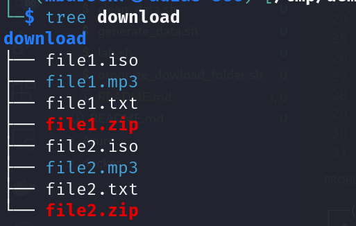
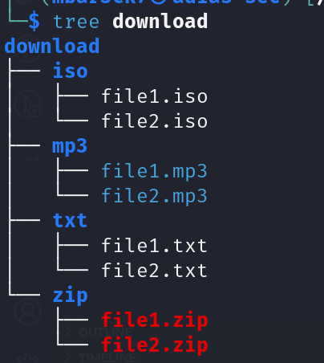

# Automation - bash scripting  

## tasks
- Write a bash script, to organize the Download folder by file extension 
- The script should create a folder per extension
- Move each file type to its created folder

## Example 
### Before running the script 



### After running the script


## Note
You can generate fake data to test with:

```
mkdir -p downloads \
&& cd downloads || exit \
&& touch file{1..7}.txt file{1..7}.mp3 file{1..7}.zip file{1..7}.pdf file{1..7}.iso \
&& ls

```